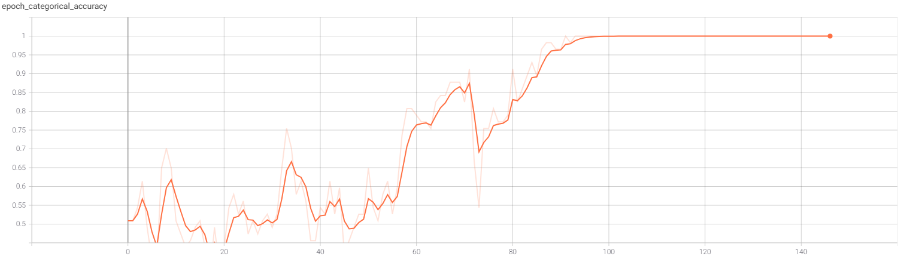
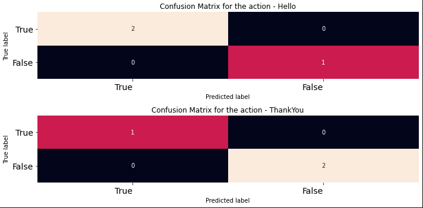
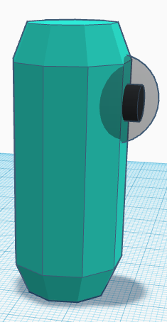
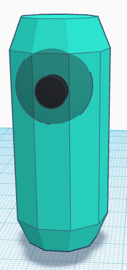

# 🤚 ASL Gesture Sensing Device (Harpocrates)

Welcome to **Harpocrates**, an innovative device designed to detect American Sign Language (ASL) gestures and provide real-time predictions. Currently, it supports basic signs like "Hello" and "Thank you," with the potential for expanding its repertoire through further training.

## 🔧 Technologies Used
`Python` `TensorFlow` `MediaPipe`

## 📝 Project Description
**Harpocrates** employs MediaPipe for hand, pose, and face detection, utilizing a Sequential Model with LSTM and Dense Layers for prediction. It captures 30 frames per action, ensuring accurate recognition. Once a gesture is predicted, it is converted to speech, making communication seamless.

**Harpocrates** serves as a bridge between sign language users and those unfamiliar with it, facilitating communication and understanding.

## 📊 Categorical Accuracy Graph

This graph illustrates the categorical accuracy's progression with increasing epochs during model training.

## 🔄 Confusion Matrix for Predictions

## 📸 Screenshots
.png)

Face, pose, and hands detection in action.

Real-time gesture prediction.

3D model of **Harpocrates**.

## 🔗 References
This project draws inspiration and guidance from [Nicholas Renotte's tutorial](https://www.youtube.com/watch?v=doDUihpj6ro).

## 📜 License

Feel free to explore and contribute to **Harpocrates**! 🚀
